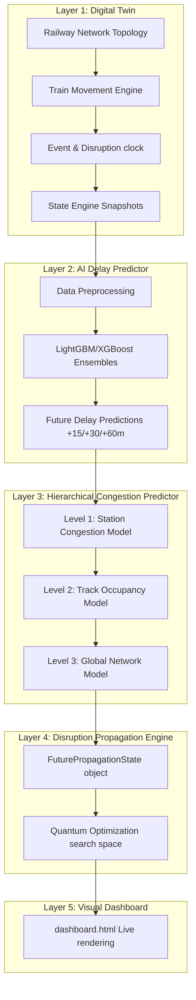
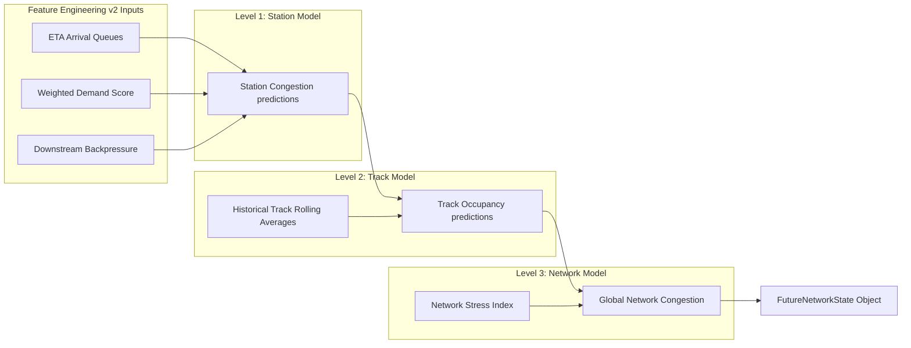
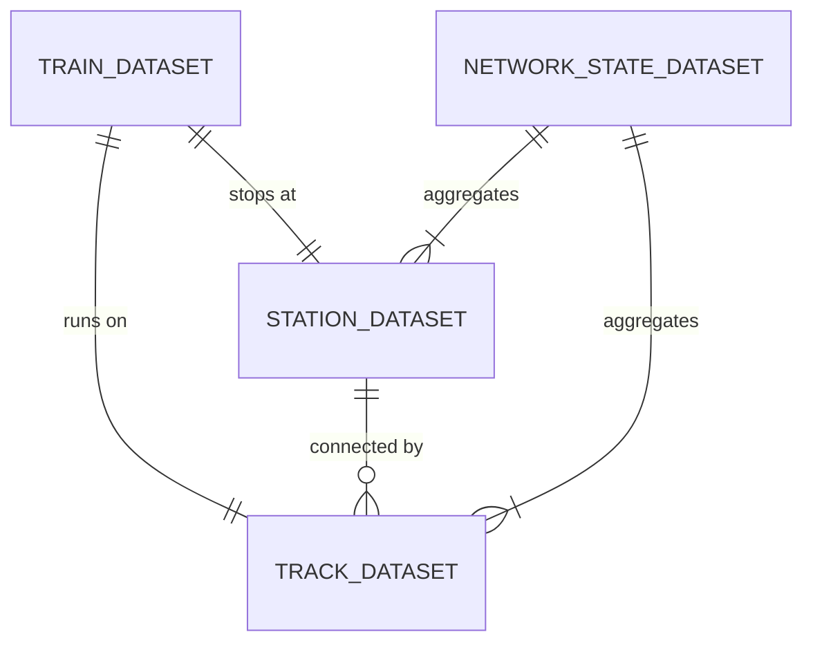

# RailTwin-Q: End-to-End System Architecture

This document provides the complete system architecture, layer configurations, data flow schemas, and api contracts for the RailTwin-Q Railway Digital Twin and Congestion Engine.

---

## 1. Overall System Architecture

The system is organized into five functional layers executing sequentially:



---

## 2. Layer-by-Layer Specifications

### Layer 1: Digital Twin
* **Network Graph**: Represented as a NetworkX Graph where stations are nodes and tracks are edges.
* **Train Movement**: Vectorized progress updates incorporating speed profiles, route stops, and dwell constraints.
* **Event System**: Injector simulating signal failures, track blockages, and storms causing primary delays.
* **State Engine**: Compiles state snapshots representing the status of all elements at tick $T$.

### Layer 2: AI Delay Prediction Engine
* **Objective**: Predicts future delay times at horizons (+15m, +30m, +60m) for every active train.
* **Inference**: LGBM/XGBoost ensembles trained on historical train trajectories.

### Layer 3: Hierarchical Congestion Engine
* **Objective**: Forecasts traffic congestion propagation across three stacked levels:
  1. **Level 1 (Station)**: Forecasts platform demand using ETA queues and decay demand scores.
  2. **Level 2 (Track)**: Forecasts track utilization merging Level 1 predicted station states.
  3. **Level 3 (Network)**: Forecasts global bottleneck counts and stress indices.

### Layer 4: Decision Intelligence Engine (Pre-Quantum Layer)
* **Objective**: Builds topological operational DAGs, traces 3-hop delay steps, isolates causal roots, evaluates cost vectors, maps optimization constraints, and generates co-optimized Scenario Action Bundles representing the search space for Layer 5 Quantum Optimization.

---

## 3. Data & AI Flows

### Hierarchical Stacked Prediction Flow
Congestion predictions flow upward, replicating the actual operational relationships of a railway system:



---

## 4. Training & Inference Pipelines

### A. Training Pipeline
1. **Scenario-Based Split**: Scenarios 1–80 are used for training, 81–90 for validation, and 91–100 for testing. This ensures the models generalize to unseen train route distributions.
2. **Preprocessor Validation Check**:
   * Removes **Constant features** (variance $\approx 0$).
   * Removes **Highly Correlated features** (Pearson Correlation $>0.98$), exempting rolling averages and core trend markers to maintain feature diversity.
3. **Hyperparameter Tuning**: Automated grid search optimizing learning rates, leaves, and estimators.
4. **Estimator Ensembles**: Fits 3-Fold cross-validated ensembles for robustness.

### B. Inference Pipeline (Live Tick Execution)
1. **Sliding Windows**: Maintain a history queue of the last 20 state snapshots.
2. **Feature Compiler**: Computes rolling averages, trends, and incoming train ETAs on the fly.
3. **Cascade Evaluation**: Evaluates Level 1, feeds outputs to Level 2, and compiles Level 3 global statistics.

---

## 5. Directory Structure

```
RailTwin-Q/
│
├── ai/
│   ├── delay_prediction/             # Layer 2 Delay Prediction models
│   └── congestion_prediction/        # Layer 3 Congestion Prediction Engine
│       ├── data_loader.py            # Dataset compilation & preparation
│       ├── feature_engineering.py     # ETA lookaheads, downstream backpressure
│       ├── preprocessing.py           # Feature selection filters (correlation pruner)
│       └── predictor.py               # Real-time inference coordinator
│
├── datasets/                         # Output folder for compiled datasets & HTMLs
│   ├── train_dataset.csv
│   ├── station_dataset.csv
│   ├── track_dataset.csv
│   ├── network_state_dataset.csv
│   └── dashboard.html                # Live Digital Twin Dashboard
│
├── models/                           # Registry folders containing scalers & ensembles
│   ├── delay_predictor/
│   └── congestion_predictor/
│       └── model_registry.json       # Version records & evaluations
│
├── reports/                          # Auto-generated verification reports
│   ├── feature_engineering_report.html
│   └── congestion_evaluation_report.html
│
├── services/                         # Digital Twin execution modules
│   ├── event_system.py               # Storms and signal failures generator
│   ├── movement_engine.py            # Physics movement formulas
│   └── state_engine.py               # Snapshots recorder
│
├── main.py                           # Main simulation runner script
└── architecture.md                   # This architecture reference sheet
```

---

## 6. Dataset Relationships



---

## 7. Model Registry & API Endpoints

### Inference Engine API Contract
The main entry point for congestion forecasting:

```python
class PredictionService:
    def __init__(self, models_dir="models/congestion_predictor"):
        """Initializes the hierarchical inference estimators."""
        pass

    def get_predictions_for_tick(self, network, tick: int, time_str: str, running_events: list, delay_preds: list) -> dict:
        """
        Computes real-time features, cascades forecasts through Level 1, 2, and 3 models,
        and returns a future network state dictionary containing predicted congestions.
        """
        return {
            "stations": [{"station_id": 1, "pred_15": 12.5, "pred_30": 15.0, "pred_60": 20.0}],
            "tracks": [{"track_id": "T1", "pred_15": 40.0, "pred_30": 45.0, "pred_60": 50.0}],
            "network": {"pred_15": 14.5, "pred_30": 15.0, "pred_60": 18.0}
        }
```
